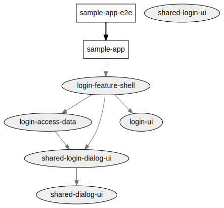

# Login 
## Access data
Contains all the connection throughout _NGRX Actions_ with the firebase auth module provide by AngularFire. The actions are exposed throughout **_facade pattern_**. 

On addition depends of `shared-login-dialog-ui` to show the dialogs. e.g ( checking auth, auth fails ) 

- **owner**: Sebastián Guevara
- **constraints**: Should be use only by the `login-feature-shell`.
    - Cannot import or depend of `UI` or `Feature Shell` Libraries
- **lazy**: false

