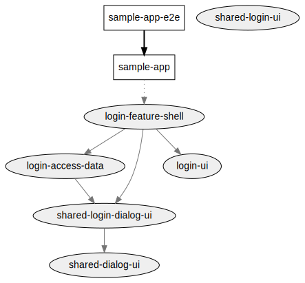

# Login 
## Feature shell
Contains all the business logic to the login feature. It's the connection with the app that implemented the library using lazy loading. 
This libs defined all the smart components to be used and often uses the `login-ui` presentational component to finish a specific flow.

- **owner**: Sebastián Guevara
- **constraints**: Should be use only by the `login-feature-shell`.
    - Cannot import or depend of `Data Access` or `Feature Shell` Libraries
- **lazy**: true

